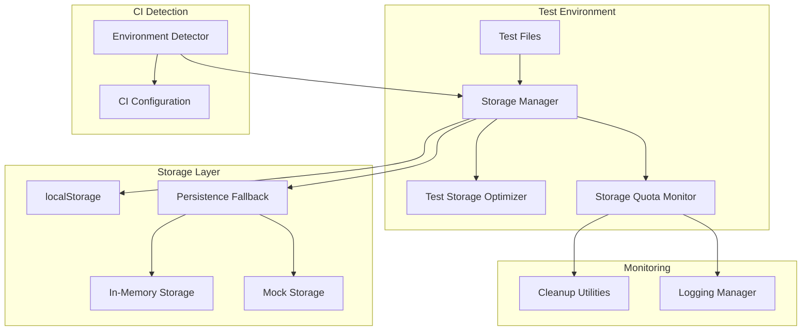

# Design Document: CI Storage Optimization

## Overview

The CI Storage Optimization feature addresses PERSISTENCE_FAILED errors occurring in GitHub Actions by implementing intelligent storage management, fallback mechanisms, and CI-specific optimizations. The system detects CI environments and automatically applies storage optimizations while maintaining test functionality and coverage.

Based on research, localStorage has a typical limit of 5MB in most browsers, and GitHub Actions runners have storage constraints that can cause test failures when multiple tests accumulate localStorage data. The solution implements a multi-layered approach: environment detection, storage optimization, fallback mechanisms, and comprehensive cleanup.

## Architecture

The system follows a layered architecture with clear separation of concerns:



## Components and Interfaces

### Environment Detector

Detects CI environments using GitHub Actions environment variables:

```typescript
interface EnvironmentDetector {
  isCIEnvironment(): boolean;
  isGitHubActions(): boolean;
  getEnvironmentType(): 'local' | 'ci' | 'github-actions';
  getCIConfiguration(): CIConfiguration;
}

interface CIConfiguration {
  maxStorageSize: number;
  compressionEnabled: boolean;
  aggressiveCleanup: boolean;
  reducedIterations: boolean;
  fallbackEnabled: boolean;
}
```

### Storage Manager

Central component managing all storage operations with CI optimizations:

```typescript
interface StorageManager {
  setItem(key: string, value: string): Promise<void>;
  getItem(key: string): Promise<string | null>;
  removeItem(key: string): Promise<void>;
  clear(): Promise<void>;
  getStorageInfo(): StorageInfo;
  enableOptimization(config: CIConfiguration): void;
}

interface StorageInfo {
  usedBytes: number;
  availableBytes: number;
  totalBytes: number;
  compressionRatio: number;
  fallbackActive: boolean;
}
```

### Test Storage Optimizer

Optimizes test data for CI environments:

```typescript
interface TestStorageOptimizer {
  optimizeTestData<T>(data: T): T;
  compressData(data: string): string;
  decompressData(compressed: string): string;
  reduceDataset<T>(dataset: T[], maxSize: number): T[];
  getOptimizedIterationCount(baseCount: number): number;
}
```

### Persistence Fallback

Provides alternative storage when localStorage fails:

```typescript
interface PersistenceFallback {
  activate(reason: FallbackReason): void;
  isActive(): boolean;
  getActiveStorage(): StorageProvider;
  getFallbackChain(): StorageProvider[];
}

type FallbackReason = 'quota_exceeded' | 'permission_denied' | 'storage_unavailable';

interface StorageProvider {
  setItem(key: string, value: string): Promise<void>;
  getItem(key: string): Promise<string | null>;
  removeItem(key: string): Promise<void>;
  clear(): Promise<void>;
  getCapacity(): number;
}
```

### Storage Quota Monitor

Monitors storage usage and triggers cleanup:

```typescript
interface StorageQuotaMonitor {
  getCurrentUsage(): Promise<StorageUsage>;
  checkQuotaStatus(): Promise<QuotaStatus>;
  registerCleanupTrigger(threshold: number, callback: () => void): void;
  startMonitoring(interval: number): void;
  stopMonitoring(): void;
}

interface StorageUsage {
  used: number;
  available: number;
  percentage: number;
}

interface QuotaStatus {
  withinLimits: boolean;
  nearLimit: boolean;
  exceeded: boolean;
  recommendedAction: 'none' | 'cleanup' | 'fallback';
}
```

## Data Models

### CI Configuration Model

```typescript
interface CIConfigurationModel {
  environment: 'local' | 'ci' | 'github-actions';
  storageOptimization: {
    enabled: boolean;
    maxStorageSize: number;
    compressionLevel: number;
    aggressiveCleanup: boolean;
  };
  testOptimization: {
    reducedIterations: boolean;
    maxIterationCount: number;
    minimalDatasets: boolean;
    maxDatasetSize: number;
  };
  fallbackConfiguration: {
    enabled: boolean;
    fallbackChain: StorageType[];
    gracefulDegradation: boolean;
  };
}

type StorageType = 'localStorage' | 'inMemory' | 'mock';
```

### Storage Metrics Model

```typescript
interface StorageMetricsModel {
  timestamp: Date;
  environment: string;
  totalUsage: number;
  peakUsage: number;
  compressionSavings: number;
  fallbackActivations: number;
  cleanupOperations: number;
  testExecutionTime: number;
  errorCount: number;
}
```

## Correctness Properties

*A property is a characteristic or behavior that should hold true across all valid executions of a system-essentially, a formal statement about what the system should do. Properties serve as the bridge between human-readable specifications and machine-verifiable correctness guarantees.*

### Property 1: CI Environment Detection and Optimization
*For any* test execution environment, when CI environment variables are present (GITHUB_ACTIONS=true, CI=true), the Storage_Manager should automatically detect the environment and enable optimization mode
**Validates: Requirements 1.1**

### Property 2: Storage Usage Reduction
*For any* test data stored in CI mode, the optimized storage usage should be at least 50% less than the unoptimized storage usage for equivalent data
**Validates: Requirements 1.2**

### Property 3: Data Compression in CI
*For any* storage operation performed in CI mode, the stored data should be in compressed format and smaller than the original uncompressed data
**Validates: Requirements 1.3**

### Property 4: Fallback Activation on Quota Errors
*For any* localStorage operation that fails with a quota exceeded error, the Persistence_Fallback should automatically activate in-memory storage as the next storage provider
**Validates: Requirements 2.1**

### Property 5: API Consistency Across Storage Backends
*For any* storage operation (setItem, getItem, removeItem, clear), the API should behave identically regardless of whether localStorage, in-memory storage, or mock storage is active
**Validates: Requirements 2.2**

### Property 6: Comprehensive Logging and Metrics
*For any* fallback activation or test completion with alternative storage, the system should generate appropriate logs and report storage metrics including usage, compression ratios, and performance data
**Validates: Requirements 2.3, 2.4**

### Property 7: Graceful Degradation Through Failure Modes
*For any* cascading storage failure (localStorage fails, then in-memory storage fails), the system should gracefully degrade to mock storage without throwing unhandled exceptions
**Validates: Requirements 2.5**

### Property 8: Dataset Size Optimization
*For any* test data generation in CI environment, the generated datasets should be smaller than equivalent datasets generated in local environment while maintaining test coverage
**Validates: Requirements 3.1**

### Property 9: Player Count Limits in CI
*For any* player data creation in CI mode, the number of players should not exceed the configured minimum essential count for the specific test scenario
**Validates: Requirements 3.2**

### Property 10: Compact Data Formats
*For any* pairing history or complex data structures stored in CI mode, the data should use compact representation formats that reduce storage footprint
**Validates: Requirements 3.3**

### Property 11: Iteration Count Reduction
*For any* property-based test running in CI environment, the iteration count should be reduced compared to local environment while maintaining reasonable test coverage
**Validates: Requirements 3.4**

### Property 12: Automatic Data Management
*For any* test data that exceeds configured size thresholds, the system should automatically apply compression or truncation to keep data within limits
**Validates: Requirements 3.5**

### Property 13: Comprehensive Storage Monitoring and Cleanup
*For any* test execution, the system should measure storage capacity at startup, monitor usage throughout execution, trigger cleanup when usage exceeds 80% of quota, and verify successful cleanup completion
**Validates: Requirements 4.1, 4.2, 4.3, 4.5**

### Property 14: Error Logging with Storage Metrics
*For any* storage error that occurs, the system should log detailed error information including current storage usage, available capacity, and relevant performance metrics
**Validates: Requirements 4.4**

### Property 15: CI-Specific Configuration Loading
*For any* test execution in GitHub Actions environment, the system should automatically load and apply CI-specific configuration settings
**Validates: Requirements 5.1**

### Property 16: Non-Essential Operation Filtering
*For any* storage operation in CI mode, non-essential operations (like debug logging to storage, temporary caches) should be disabled or bypassed
**Validates: Requirements 5.2**

### Property 17: Lightweight Test Fixtures
*For any* integration test running in CI environment, the system should use lightweight test fixtures that consume minimal storage while providing adequate test coverage
**Validates: Requirements 5.4**

### Property 18: Storage Isolation in Parallel Tests
*For any* parallel test execution in CI environment, each test process should have isolated storage that doesn't interfere with other concurrent test processes
**Validates: Requirements 5.5**

<function_calls>
<invoke name="prework">
<parameter name="featureName">ci-storage-optimization

## Error Handling

### Storage Quota Exceeded Errors

When localStorage quota is exceeded:
1. **Immediate Fallback**: Activate in-memory storage automatically
2. **Error Logging**: Log detailed error with storage metrics
3. **Graceful Degradation**: Continue test execution without interruption
4. **Cleanup Trigger**: Attempt aggressive cleanup for future operations

### Environment Detection Failures

When CI environment detection fails:
1. **Safe Defaults**: Default to local environment behavior
2. **Warning Logs**: Log detection failure for debugging
3. **Manual Override**: Allow manual CI mode activation via environment variable
4. **Fallback Detection**: Use multiple detection methods (GITHUB_ACTIONS, CI, NODE_ENV)

### Compression/Decompression Errors

When data compression fails:
1. **Fallback to Uncompressed**: Store data without compression
2. **Error Tracking**: Track compression failure rates
3. **Size Validation**: Ensure uncompressed data still fits within limits
4. **Alternative Compression**: Try different compression algorithms

### Cleanup Operation Failures

When storage cleanup fails:
1. **Partial Cleanup**: Complete what cleanup is possible
2. **Force Clear**: Attempt complete localStorage.clear() as last resort
3. **Fallback Activation**: Switch to alternative storage if cleanup impossible
4. **Error Reporting**: Report cleanup failures with detailed diagnostics

## Testing Strategy

### Dual Testing Approach

The system requires both unit tests and property-based tests for comprehensive coverage:

**Unit Tests** focus on:
- Specific CI environment detection scenarios (GitHub Actions, generic CI)
- Edge cases in storage quota handling
- Error conditions and fallback activation
- Integration points between components
- Specific compression algorithm behavior

**Property-Based Tests** focus on:
- Universal properties across all storage backends
- Data integrity through compression/decompression cycles
- Storage usage reduction guarantees
- Cleanup completeness across different data patterns
- API consistency regardless of active storage provider

### Property-Based Testing Configuration

- **Testing Library**: Use fast-check for TypeScript property-based testing
- **Minimum Iterations**: 100 iterations per property test (reduced to 25 in CI)
- **Test Tagging**: Each property test tagged with format: **Feature: ci-storage-optimization, Property {number}: {property_text}**
- **CI Optimization**: Property tests themselves use reduced iterations when running in CI

### Test Environment Setup

**Local Environment**:
- Full iteration counts for thorough testing
- Complete datasets for comprehensive coverage
- All storage backends tested
- Performance benchmarking enabled

**CI Environment**:
- Reduced iteration counts (25% of local)
- Minimal datasets for faster execution
- Focus on critical path testing
- Storage optimization active during testing

### Mock and Stub Strategy

**localStorage Mocking**:
- Mock localStorage with configurable quota limits
- Simulate quota exceeded errors
- Track storage usage and operations
- Support multiple storage backends

**Environment Mocking**:
- Mock process.env for CI detection testing
- Simulate different CI environments
- Test configuration loading scenarios
- Verify environment-specific behavior

### Integration Testing

**End-to-End Scenarios**:
- Complete test suite execution with storage optimization
- Fallback activation and recovery scenarios
- Parallel test execution with storage isolation
- Performance impact measurement

**Cross-Browser Compatibility**:
- Test storage behavior across different jsdom configurations
- Verify consistent behavior in Node.js test environment
- Validate fallback mechanisms work universally