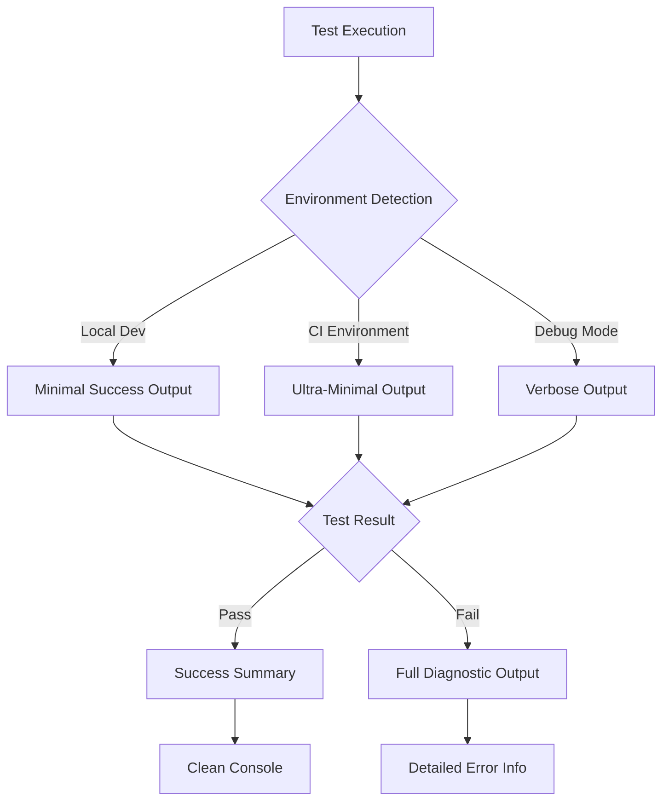

# Design Document: Test Output Optimization

## Overview

This design implements a comprehensive test output optimization system that provides minimal, clean output for successful tests while maintaining full diagnostic information for failures. The solution focuses on configuring existing test runners (Jest and Playwright) with appropriate reporters and output settings rather than building custom tooling.

## Architecture

The design leverages native reporter configurations in Jest and Playwright, supplemented by environment-aware configuration that automatically adjusts verbosity based on execution context (local development, CI, debugging).



## Components and Interfaces

### Jest Configuration Manager
Manages Jest reporter configuration based on environment and verbosity settings.

**Interface:**
```typescript
interface JestConfigManager {
  getReporterConfig(environment: Environment, verbose: boolean): JestReporterConfig;
  shouldSuppressConsole(testResult: TestResult): boolean;
}
```

### Playwright Configuration Manager
Manages Playwright reporter configuration for different execution contexts.

**Interface:**
```typescript
interface PlaywrightConfigManager {
  getReporterConfig(environment: Environment): PlaywrightReporterConfig;
  shouldShowBrowserLogs(testResult: TestResult): boolean;
}
```

### Environment Detector
Detects execution environment and verbosity preferences.

**Interface:**
```typescript
interface EnvironmentDetector {
  getCurrentEnvironment(): Environment;
  isVerboseMode(): boolean;
  isCIEnvironment(): boolean;
}

type Environment = 'local' | 'ci' | 'debug';
```

## Data Models

### Test Output Configuration
```typescript
interface TestOutputConfig {
  environment: Environment;
  verboseMode: boolean;
  jest: {
    reporters: string[];
    silent: boolean;
    verbose: boolean;
  };
  playwright: {
    reporter: string | string[];
    use: {
      trace: 'on-first-retry' | 'retain-on-failure' | 'off';
      video: 'retain-on-failure' | 'off';
    };
  };
}
```

### Test Result Summary
```typescript
interface TestResultSummary {
  framework: 'jest' | 'playwright';
  totalTests: number;
  passedTests: number;
  failedTests: number;
  executionTime: number;
  failures: TestFailure[];
}

interface TestFailure {
  testName: string;
  errorMessage: string;
  stackTrace: string;
  additionalContext?: any;
}
```

## Implementation Strategy

### Jest Optimization
1. **Success Mode**: Use `summary` reporter with `silent: true` to suppress console output from tests
2. **Failure Mode**: Use `verbose` reporter with full error details and stack traces
3. **Configuration**: Dynamically set reporters based on environment variables

### Playwright Optimization  
1. **Success Mode**: Use `line` or `dot` reporter for minimal progress indication
2. **Failure Mode**: Use `list` reporter with full browser logs and trace information
3. **Configuration**: Set reporter arrays to combine minimal progress with detailed failure reporting

### Environment-Aware Configuration
1. **Local Development**: Balanced output with clear success/failure distinction
2. **CI Environment**: Ultra-minimal success output, full failure diagnostics
3. **Debug Mode**: Full verbose output for all tests regardless of result

## Configuration Files

### Jest Configuration (jest.config.js)
```javascript
const isCI = process.env.CI === 'true';
const isVerbose = process.env.VERBOSE_TESTS === 'true';

module.exports = {
  // Existing configuration...
  
  reporters: isVerbose 
    ? ['verbose']
    : isCI 
      ? [['summary', { summaryThreshold: 0 }]]
      : ['summary'],
      
  silent: !isVerbose,
  verbose: isVerbose,
  
  // Suppress console output from passing tests
  setupFilesAfterEnv: ['<rootDir>/test-setup.js']
};
```

### Playwright Configuration (playwright.config.ts)
```typescript
export default defineConfig({
  // Existing configuration...
  
  reporter: process.env.VERBOSE_TESTS === 'true'
    ? [['list'], ['html']]
    : process.env.CI 
      ? 'dot'
      : [['line'], ['html', { open: 'never' }]],
      
  use: {
    // Show traces and videos only on failure
    trace: 'retain-on-failure',
    video: 'retain-on-failure',
  },
});
```

## Correctness Properties

*A property is a characteristic or behavior that should hold true across all valid executions of a system-essentially, a formal statement about what the system should do. Properties serve as the bridge between human-readable specifications and machine-verifiable correctness guarantees.*

### Property Reflection

After analyzing all acceptance criteria, several properties can be consolidated to eliminate redundancy:

- Properties about Jest and Playwright output formatting can be combined into framework-agnostic properties
- Properties about success/failure output can be generalized across all test types
- Properties about environment-specific behavior can be unified under configuration management
- Properties about CI optimization can be consolidated into environment-aware behavior

### Core Properties

**Property 1: Minimal Success Output**
*For any* passing test execution, the output should contain only essential success information without verbose logs, stack traces, or debugging details
**Validates: Requirements 1.1, 1.3, 3.2, 4.2**

**Property 2: Comprehensive Failure Output**
*For any* failing test execution, the output should include complete diagnostic information including error details, stack traces, execution context, and all available debugging information
**Validates: Requirements 2.1, 2.2, 2.3, 3.3, 4.3**

**Property 3: Environment-Aware Configuration**
*For any* test execution environment (local, CI, debug), the test runner should apply appropriate output verbosity settings that match the environment's requirements
**Validates: Requirements 3.4, 4.4, 5.3, 5.4, 7.1**

**Property 4: Verbosity Override Behavior**
*For any* test execution with verbose flags enabled, the output should display detailed information for all tests regardless of pass/fail status
**Validates: Requirements 5.1, 5.2, 5.5**

**Property 5: Console Output Suppression**
*For any* passing test that contains console.log statements, those statements should not appear in the test output unless verbose mode is enabled
**Validates: Requirements 3.5, 4.5**

**Property 6: Cross-Framework Consistency**
*For any* test execution across different frameworks (Jest, Playwright), the output formatting for success indicators, test counts, and execution times should follow consistent patterns
**Validates: Requirements 6.1, 6.2, 6.3, 6.4, 6.5**

**Property 7: CI Output Optimization**
*For any* test execution in CI environments, the output should prioritize failure information over success details and avoid interactive elements
**Validates: Requirements 7.2, 7.3, 7.4, 7.5**

**Property 8: Summary Completeness**
*For any* test suite execution, the final summary should include total test count, pass/fail counts, and execution time in a consistent format
**Validates: Requirements 1.2, 1.4, 1.5**

**Property 9: Multiple Failure Handling**
*For any* test execution with multiple failures, each failure should receive complete diagnostic output without truncation or loss of information
**Validates: Requirements 2.4, 7.3**

## Error Handling

### Configuration Errors
- **Invalid Reporter Configuration**: Fall back to default reporters if custom configuration fails
- **Environment Detection Failure**: Default to local development settings with verbose output
- **Missing Dependencies**: Gracefully handle missing reporter packages with clear error messages

### Runtime Errors
- **Test Framework Crashes**: Ensure error information is captured even if the test runner fails
- **Output Truncation**: Implement safeguards to prevent loss of critical failure information
- **Permission Issues**: Handle file system permission errors when writing test artifacts

### Recovery Strategies
- **Configuration Validation**: Validate reporter configurations before test execution
- **Fallback Reporters**: Maintain backup reporter configurations for each environment
- **Error Logging**: Log configuration and runtime errors to help diagnose output issues

## Testing Strategy

### Dual Testing Approach
This feature requires both unit tests and property-based tests to ensure comprehensive coverage:

**Unit Tests** will verify:
- Specific configuration scenarios (CI detection, verbose flags, etc.)
- Error handling edge cases (invalid configurations, missing reporters)
- Integration points between Jest and Playwright configurations
- Environment variable parsing and validation

**Property-Based Tests** will verify:
- Universal properties across all test execution scenarios
- Output format consistency across different input combinations
- Configuration behavior across all supported environments
- Comprehensive input coverage through randomization

### Property Test Configuration
- **Testing Framework**: Use Jest with fast-check for property-based testing
- **Test Iterations**: Minimum 100 iterations per property test
- **Test Tagging**: Each property test must reference its design document property
- **Tag Format**: **Feature: test-output-optimization, Property {number}: {property_text}**

### Test Implementation Requirements
- Each correctness property must be implemented by a single property-based test
- Property tests should generate random test configurations and verify expected output behavior
- Unit tests should focus on specific examples and edge cases not covered by properties
- All tests must validate actual test runner output, not mocked behavior