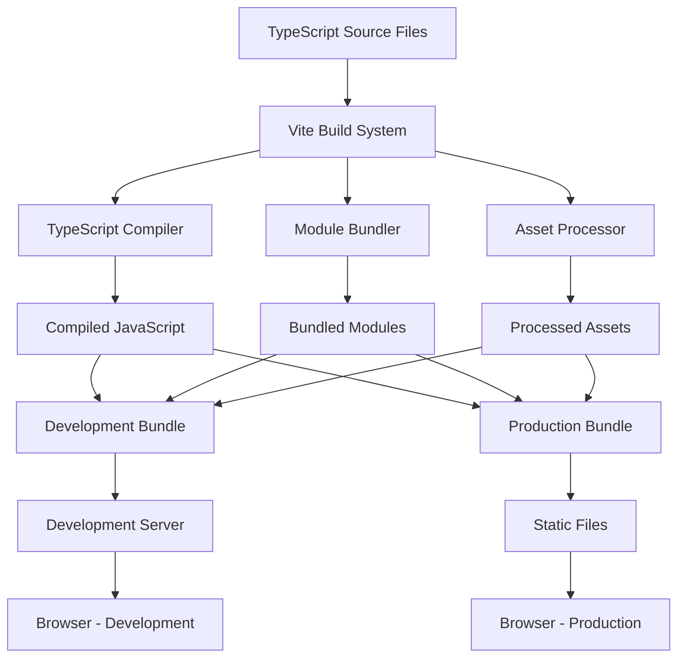
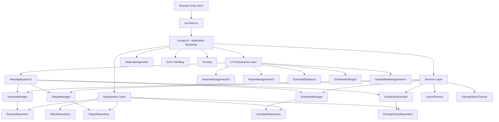

# Design Document: TypeScript Application Activation

## Overview

This design outlines the technical approach for activating the sophisticated TypeScript application that currently exists as dead code in the `src/` directory. The activation will use Vite as a modern build tool to bundle the TypeScript application for browser execution while preserving all advanced features including dependency injection, service layers, and comprehensive UI components.

The TypeScript application represents a significant architectural upgrade over the simple JavaScript version, providing:
- Repository pattern for data access
- Service layer for business logic
- Dependency injection for loose coupling
- State management for application state
- Advanced error handling and routing
- Import/export capabilities
- Pairing history optimization
- Multiple UI components with separation of concerns

## Architecture

### Build System Architecture



### Application Architecture



## Components and Interfaces

### Vite Configuration

The Vite configuration will handle TypeScript compilation, module bundling, and development server setup:

```typescript
// vite.config.ts
export default defineConfig({
  root: 'public',
  build: {
    outDir: '../dist',
    rollupOptions: {
      input: {
        main: resolve(__dirname, 'public/index.html')
      }
    }
  },
  resolve: {
    alias: {
      '@': resolve(__dirname, 'src')
    }
  },
  server: {
    port: 3000
  }
})
```

### Entry Point Modification

The HTML entry point will be updated to load the bundled TypeScript application:

```html
<!-- public/index.html -->
<script type="module" src="/src/index.ts"></script>
```

### Build Scripts Integration

Package.json scripts will be updated to use Vite:

```json
{
  "scripts": {
    "dev": "vite",
    "build": "vite build",
    "preview": "vite preview",
    "serve": "vite preview --port 3000"
  }
}
```

### Module Resolution Strategy

The TypeScript application uses ES6 modules with complex dependency injection. Vite will:

1. **Resolve all imports**: Handle `import` statements across all TypeScript files
2. **Bundle dependencies**: Create a single bundle with all required modules
3. **Preserve class structure**: Maintain TypeScript class inheritance and interfaces
4. **Handle circular dependencies**: Resolve any circular imports in the service layer

### Data Compatibility Layer

To ensure backward compatibility with the simple version's localStorage data:

```typescript
interface DataMigration {
  migrateSeasons(simpleData: any[]): Season[];
  migratePlayers(simpleData: any[]): Player[];
  migrateSettings(simpleData: any): ApplicationSettings;
}
```

## Data Models

### Enhanced Models

The TypeScript version includes sophisticated data models not present in the simple version:

```typescript
// Enhanced Season model with validation
class Season {
  constructor(
    public id: string,
    public name: string,
    public startDate: Date,
    public endDate: Date,
    public isActive: boolean = false,
    public settings: SeasonSettings = new SeasonSettings()
  ) {}
  
  validate(): ValidationResult;
  getDuration(): number;
  getWeeks(): Week[];
}

// Enhanced Player model with availability
class Player {
  constructor(
    public id: string,
    public firstName: string,
    public lastName: string,
    public handedness: 'left' | 'right',
    public timePreference: 'AM' | 'PM' | 'Either',
    public seasonId: string,
    public availability: WeeklyAvailability = new WeeklyAvailability()
  ) {}
  
  getFullName(): string;
  isAvailable(weekId: string): boolean;
  getPairingHistory(): PairingHistory[];
}
```

### State Management Models

```typescript
interface ApplicationState {
  seasons: Season[];
  activeSeason: Season | null;
  players: Player[];
  weeks: Week[];
  currentSchedule: Schedule | null;
  selectedWeek: Week | null;
  isLoading: boolean;
  hasError: boolean;
  errorMessage?: string;
  isInitialized: boolean;
}
```

## Correctness Properties

*A property is a characteristic or behavior that should hold true across all valid executions of a system-essentially, a formal statement about what the system should do. Properties serve as the bridge between human-readable specifications and machine-verifiable correctness guarantees.*

### Property 1: Build System Compilation
*For any* valid TypeScript source file in the src directory, the build system should successfully compile it to JavaScript without errors
**Validates: Requirements 1.1, 1.4**

### Property 2: Module Resolution Completeness
*For any* import statement in the TypeScript application, the build system should resolve it to the correct module without missing dependencies
**Validates: Requirements 2.1, 2.4**

### Property 3: Dependency Injection Correctness
*For any* service class instantiation, the dependency injection system should provide the correct repository instances as specified in the constructor
**Validates: Requirements 2.2, 2.3**

### Property 4: UI Component Service Access
*For any* UI component that requires services, the component should have access to all required service methods and properties
**Validates: Requirements 2.3, 3.2**

### Property 5: Feature Parity Preservation
*For any* functionality available in the simple version (season creation, player addition, schedule generation, tab navigation), the TypeScript version should provide equivalent or enhanced functionality
**Validates: Requirements 4.1, 4.2, 4.3, 4.4**

### Property 6: Data Persistence Consistency
*For any* data operation (create, update, delete), the TypeScript application should persist changes to localStorage in a format compatible with the simple version
**Validates: Requirements 4.5, 10.2, 10.4**

### Property 7: Error Handling Robustness
*For any* error condition that occurs during application execution, the system should display user-friendly error messages and maintain application stability
**Validates: Requirements 3.3, 5.1**

### Property 8: Advanced Feature Functionality
*For any* advanced feature (import/export, pairing history, availability management, schedule editing), the feature should work correctly and provide value beyond the simple version
**Validates: Requirements 5.2, 5.3, 5.4, 5.5, 5.6**

### Property 9: Production Build Optimization
*For any* production build, the output should be minified, optimized, and smaller than the development build while maintaining all functionality
**Validates: Requirements 7.1, 7.2, 7.5**

### Property 10: Test Suite Compatibility
*For any* existing Playwright test, the test should pass when run against the TypeScript application with the same or better results than the simple version
**Validates: Requirements 4.6, 8.1, 8.2, 8.3, 8.4**

## Error Handling

### Build-Time Error Handling

1. **TypeScript Compilation Errors**: Clear error messages with file locations and suggestions
2. **Module Resolution Errors**: Detailed information about missing dependencies
3. **Configuration Errors**: Validation of Vite and TypeScript configurations

### Runtime Error Handling

1. **Initialization Errors**: Graceful fallback with error reporting
2. **Service Layer Errors**: Proper error propagation with user-friendly messages
3. **UI Component Errors**: Error boundaries to prevent application crashes
4. **Data Migration Errors**: Safe fallback to empty state with user notification

### Development Error Handling

1. **Hot Reload Errors**: Clear indication when hot reload fails
2. **Source Map Errors**: Proper debugging information in development
3. **Linting Errors**: Integration with TypeScript strict mode and ESLint

## Testing Strategy

### Dual Testing Approach

The testing strategy will use both unit tests and property-based tests to ensure comprehensive coverage:

- **Unit tests**: Verify specific examples, edge cases, and error conditions
- **Property tests**: Verify universal properties across all inputs
- Both are complementary and necessary for comprehensive coverage

### Property-Based Testing Configuration

- Use fast-check library for property-based testing in TypeScript
- Minimum 100 iterations per property test
- Each property test must reference its design document property
- Tag format: **Feature: typescript-activation, Property {number}: {property_text}**

### Testing Phases

1. **Build System Tests**: Verify Vite configuration and TypeScript compilation
2. **Module Resolution Tests**: Verify all imports resolve correctly
3. **Integration Tests**: Verify the full application works end-to-end
4. **Compatibility Tests**: Verify existing Playwright tests pass
5. **Performance Tests**: Verify build times and bundle sizes are acceptable

### Test Environment Setup

- Development testing with Vite dev server
- Production testing with built bundles
- Cross-browser testing with Playwright
- Automated testing in CI/CD pipeline

The testing strategy ensures that the TypeScript activation maintains all existing functionality while adding new capabilities, providing confidence in the migration from the simple JavaScript version to the sophisticated TypeScript application.